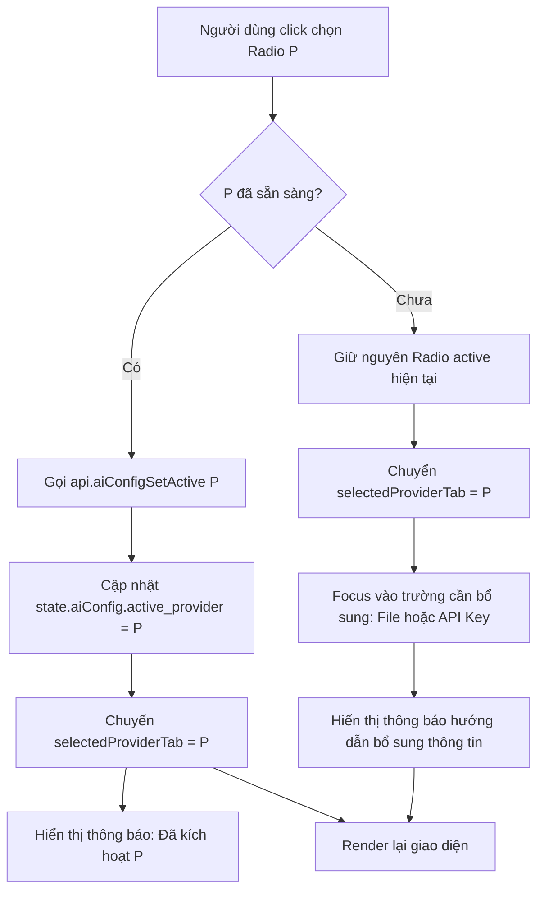

# Thiết kế Kỹ thuật: Cải tiến UX Màn hình Cài đặt Mô hình AI (Tách bạch Lưu cấu hình & Kích hoạt)

- **Ngày tạo**: 2026-09-03
- **Trạng thái**: Draft (Chờ user review)
- **Phạm vi**: Giao diện Desktop (`main.ts`, `styles.css`), Điều phối cấu hình AI (`aiConfig`), Xử lý tương tác và phản hồi người dùng

---

## 1. Mục tiêu và Bối cảnh

### 1.1 Bối cảnh và Vấn đề
Trong ứng dụng SoátVăn, người dùng có thể sử dụng 1 trong 3 nguồn LLM để rà soát toàn văn:
1. **Mô hình cục bộ (Offline GGUF / `.svmodel`)**
2. **OpenAI / Tương thích (OpenAI, DeepSeek, Groq, OpenRouter...)**
3. **Google Gemini API**

Tuy nhiên, màn hình Cài đặt Mô hình LLM (`#settings-models`) hiện tại gây bối rối và khó hiểu cho người dùng:
1. **Nhầm lẫn giữa "Chuyển Tab" và "Kích hoạt"**: 3 nút tab trên cùng (`Local`, `OpenAI`, `Gemini`) được thiết kế dạng khối lớn giống hệt như các nút lựa chọn chế độ. Khi click vào một tab, tab đó sáng viền và đổi màu xanh (`.selected`), khiến người dùng lầm tưởng rằng mình đã kích hoạt nguồn AI đó. Nhưng thực tế đó chỉ là thao tác chuyển tab hiển thị form cài đặt, còn AI đang chạy vẫn là nguồn cũ.
2. **Huy hiệu "Đang dùng" mờ nhạt**: Nhãn `Đang dùng` là một badge nhỏ xíu nằm cạnh chữ `Offline` / `Cloud`, rất dễ bị lấn át bởi màu sắc của tab được click chọn.
3. **Hành vi "Lưu" và "Kích hoạt" bị gộp làm một**: Nút hành động ở tab Cloud ghi là `[Lưu & Kích hoạt]`. Nếu người dùng đã lưu thông tin OpenAI từ trước và hiện đang dùng Local, khi mở tab OpenAI họ không thấy nút `Kích hoạt` độc lập mà vẫn thấy `[Lưu & Kích hoạt]`, gây hoang mang không biết có phải nhập lại API Key hay có bị lưu đè dữ liệu không.
4. **Vị trí nút kích hoạt không nhất quán**: Ở tab Local, nút kích hoạt là `[Kích hoạt]` nhỏ nằm trong thẻ model; ở tab Cloud, nút lại nằm ở footer bên dưới.

### 1.2 Mục tiêu cải tiến
- **Trực quan hóa 100% nguồn AI đang chạy**: Đưa khu vực chọn nguồn AI kích hoạt lên một khối riêng biệt ở trên cùng (Active AI Selector) với radio buttons rõ ràng, có trạng thái `● Đang hoạt động`.
- **Tự động hỗ trợ người dùng khi chọn nguồn chưa sẵn sàng**: Nếu người dùng click vào Radio của nguồn chưa có cấu hình (chưa có model GGUF hoặc chưa có API Key), hệ thống giữ nguyên nguồn active cũ, tự động chuyển tab cấu hình tương ứng bên dưới và focus vào trường cần nhập kèm thông báo hướng dẫn.
- **Tách bạch rõ ràng giữa "Lưu cấu hình" và "Kích hoạt"**:
  - `[Lưu cấu hình]`: Lưu thông tin vào SQLite `preferences.db` mà không thay đổi nguồn AI đang chạy.
  - `[Kích hoạt nguồn này]`: Bật nguồn này làm AI rà soát chính (hoặc tick chọn Radio ở trên).
- **Trải nghiệm kiểm tra kết nối mượt mà**: Nút `[Kiểm tra kết nối]` hoạt động độc lập, hiển thị kết quả ngay tức thì.

---

## 2. Thiết kế Giao diện & Trải nghiệm Người dùng (UI/UX)

Trang `#settings-models` được bố cục thành 2 khối mạch lạc theo chiều dọc:

```
+-----------------------------------------------------------------------------------+
|  Mô hình LLM                                                                     |
|  Chọn nguồn AI rà soát và cấu hình các nhà cung cấp kết nối.                       |
+-----------------------------------------------------------------------------------+
|  [ KHỐI 1: NGUỒN AI RÀ SOÁT CHÍNH (Active AI Selector) ]                          |
|                                                                                   |
|  (●) Mô hình cục bộ (GGUF)   (○) OpenAI / Tương thích   (○) Google Gemini API     |
|      Đã cài đặt (v0.1)           Đã lưu key: sk-...a1b2     Chưa lưu API key      |
|      ● Đang hoạt động                                                             |
+-----------------------------------------------------------------------------------+
|  [ KHỐI 2: TAB CẤU HÌNH CHI TIẾT (Configuration Tabs) ]                           |
|                                                                                   |
|  [ 🖥️ Mô hình cục bộ ]   [ 🌐 OpenAI / Tương thích ]   [ ✨ Google Gemini API ]    |
|  -------------------------------------------------------------------------------  |
|  (Nội dung form chi tiết của Provider đang được chọn tab)                         |
|                                                                                   |
|  - Đối với Local: Thẻ model GGUF, nút Thay / Gỡ / Nhập file                      |
|  - Đối với Cloud: Banner bảo mật, Base URL, API Key, Model Name                  |
|  - Kết quả kiểm tra kết nối (nếu có)                                             |
+-----------------------------------------------------------------------------------+
|  [ FOOTER / NÚT HÀNH ĐỘNG ]                                                       |
|  [Kiểm tra kết nối]                                  [Lưu cấu hình]  [Kích hoạt]  |
+-----------------------------------------------------------------------------------+
```

### 2.1 Khối 1: Thanh chọn nguồn AI kích hoạt (Active AI Selector)
- **Bao gồm 3 thẻ Radio (Segmented Radio Cards)**:
  1. **Mô hình cục bộ**:
     - Tiêu đề: `Mô hình cục bộ (Offline GGUF)`
     - Trạng thái phụ: `Đã cài đặt (tên/phiên bản)` nếu đã có model, hoặc `Chưa nạp file model`.
     - Badge hoạt động: `● Đang hoạt động` (nếu đang active).
  2. **OpenAI / Tương thích**:
     - Tiêu đề: `OpenAI / Tương thích`
     - Trạng thái phụ: `Đã lưu key: sk-...xxxx` nếu đã có key, hoặc `Chưa lưu API key`.
     - Badge hoạt động: `● Đang hoạt động` (nếu đang active).
  3. **Google Gemini API**:
     - Tiêu đề: `Google Gemini API`
     - Trạng thái phụ: `Đã lưu key: AIza...xxxx` nếu đã có key, hoặc `Chưa lưu API key`.
     - Badge hoạt động: `● Đang hoạt động` (nếu đang active).

### 2.2 Khối 2: Tabs Cấu hình chi tiết
- 3 tab chuyển đổi giao diện dạng Pill / Tab thông thường:
  `[ 🖥️ Mô hình cục bộ ]` `[ 🌐 OpenAI / Tương thích ]` `[ ✨ Google Gemini API ]`
- Tab được chọn hiển thị viền nổi bật.
- Nếu tab đang xem trùng với provider đang active, có biểu tượng nhỏ `● Đang dùng` bên cạnh tên tab.

### 2.3 Khu vực nút bấm hành động (Action Buttons)
- **Khi đang xem tab Local**:
  - `[📂 Nhập file model]` (nếu chưa có) hoặc `[📂 Thay model]` và `[Gỡ]` (nếu đã có).
  - Nút `[Kích hoạt nguồn này]` (chỉ bật sáng khi đã cài model và chưa active).
- **Khi đang xem tab Cloud (OpenAI / Gemini)**:
  - `[Kiểm tra kết nối]`: Nằm ở góc trái hoặc hàng nút phụ. Thử kết nối API bằng thông tin trong form/DB.
  - `[Lưu cấu hình]`: Lưu Base URL, API Key, Model Name vào SQLite. Không thay đổi nguồn active.
  - `[Kích hoạt nguồn này]`:
    - Nếu nguồn này đang active: nút hiển thị `✓ Đang kích hoạt` (disabled).
    - Nếu nguồn này chưa active: nút sáng lên `Kích hoạt nguồn này`. Nếu form có thay đổi chưa lưu, hệ thống tự động lưu trước rồi kích hoạt.

---

## 3. Luồng dữ liệu và Tương tác (Interaction Logic)

### 3.1 Tương tác click Radio Khối 1
Khi người dùng click vào một Radio $P \in \{\text{local}, \text{openai}, \text{gemini}\}$:



**Điều kiện sẵn sàng của từng provider:**
- `local`: `state.model.state === "ready" || state.model.state === "installed"`.
- `openai`: Đã có `api_key` trong `state.aiConfig.configs` (hoặc `draft.apiKey.trim()`).
- `gemini`: Đã có `api_key` trong `state.aiConfig.configs` (hoặc `draft.apiKey.trim()`).

### 3.2 Tách biệt Lưu cấu hình và Kích hoạt
1. **Lưu cấu hình (`saveCloudConfigOnly`)**:
   - Gửi payload `{ provider, apiKey, baseUrl, modelName, isActive: false }` (hoặc giữ nguyên `isActive` hiện tại).
   - Gọi `api.aiConfigUpdate(...)`.
   - Cập nhật lại `state.aiConfig` từ backend.
   - Xóa trắng draft `apiKey`, hiển thị placeholder masked key mới.
   - Hiển thị thông báo: `Đã lưu cấu hình [Tên Provider].`
   - Nguồn AI active (`state.aiConfig.active_provider`) không bị xáo trộn.

2. **Kích hoạt nguồn (`activateProvider(provider)`)**:
   - Nếu ở tab Cloud và người dùng đang gõ dở thông tin chưa lưu, tự động lưu trước.
   - Gọi `api.aiConfigSetActive(provider)`.
   - Cập nhật lại `state.aiConfig` và `state.model` (qua `modelStatus(true)`).
   - Cập nhật các cờ `state.useModel = true`, `state.fullReview = true`.
   - Hiển thị thông báo: `Đã kích hoạt [Tên Provider] làm nguồn rà soát chính.`

---

## 4. Xử lý Ngoại lệ & Bảo mật

1. **Bảo mật API Key**:
   - Khi API Key đã được lưu, backend chỉ trả về `masked_key` (dạng `sk-...xxxx` hoặc `AIza...xxxx`).
   - Placeholder của ô input hiển thị `masked_key`. Nếu người dùng không nhập gì vào ô API Key khi nhấn "Lưu", backend giữ nguyên API Key hiện tại trong DB.
2. **Khóa tương tác khi bận (`controlsLocked`)**:
   - Khi đang lưu cấu hình, kiểm tra kết nối, hoặc đang trong quá trình rà soát tài liệu, các nút Radio và nút hành động đều chuyển sang trạng thái vô hiệu hóa (`disabled`) kèm chỉ báo quay (`aria-busy`).
3. **Gỡ bỏ mô hình cục bộ khi đang active**:
   - Nếu người dùng bấm gỡ model GGUF trong khi Local đang là nguồn active, hệ thống gỡ an toàn, chuyển trạng thái Local sang "Chưa cài đặt". Màn hình rà soát sẽ tự động thông báo chỉ áp dụng quy tắc cố định (không dùng AI) cho đến khi người dùng chọn nguồn khác.

---

## 5. Kế hoạch Kiểm thử & Xác minh

### 5.1 Kiểm thử Backend / IPC Sidecar
- Chạy toàn bộ test suite hiện có của engine: `uv run --project engine pytest engine/tests/test_ai_config_repository.py engine/tests/test_sidecar.py -v`.
- Đảm bảo `ai_config.update` không ghi đè `is_active` khi chỉ cập nhật thông số kết nối.

### 5.2 Kiểm thử Frontend Desktop
- Kiểm tra build TypeScript: `npm run build` trong `apps/desktop`.
- Chạy UI test:
  1. Chuyển đổi nhanh 3 nút Radio ở thanh trên khi cả 3 đã được cấu hình -> Radio và badge `● Đang hoạt động` nhảy chính xác.
  2. Click Radio của nguồn chưa cấu hình -> Tự động chuyển tab cấu hình bên dưới, focus vào ô cần nhập, hiện thông báo nhắc nhở.
  3. Nhập API Key cho OpenAI và nhấn "Lưu cấu hình" -> Thông tin được lưu, Local vẫn giữ nguyên trạng thái active.
  4. Nhấn "Kích hoạt nguồn này" ở tab OpenAI -> OpenAI chuyển thành active, Radio phía trên chuyển sang OpenAI.
  5. Bước "Chuẩn bị rà soát" hiển thị đúng huy hiệu và nhãn của AI đang kích hoạt.
