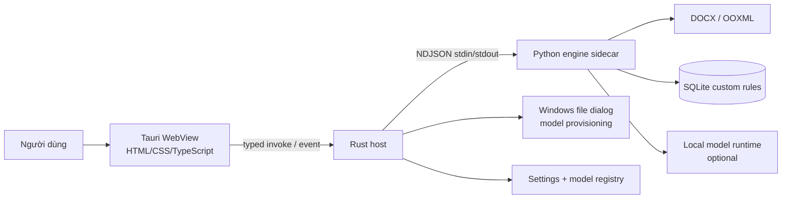

# Technical Design — SoátVăn Desktop

| | |
|---|---|
| **Phiên bản** | 0.4 — bộ kiểm tra cố định + CRUD quy tắc riêng |
| **Ngày** | 25/8/2026 |
| **Nguồn yêu cầu** | [`docs/prd.md`](./prd.md) phiên bản 0.3 |
| **Nền tảng** | Windows 10/11 x64 |
| **Trạng thái** | M0/M1 và M2 runtime/provisioning đã có implementation; model/corpus thật và các gate môi trường ở `implementation-status.md` |

## 1. Kết luận kỹ thuật

SoátVăn nên được xây như một **modular desktop monolith** gồm ba ranh giới rõ ràng:

1. **Tauri 2 + HTML/CSS/TypeScript** hiển thị giao diện và trạng thái phiên làm việc.
2. **Rust host** là ranh giới với hệ điều hành: mở/lưu file, kiểm tra đường dẫn, quản lý Python sidecar, model provisioning và policy bảo mật.
3. **Python engine** chứa toàn bộ nghiệp vụ: đọc DOCX, chuẩn hoá, chạy luật, lọc candidate hoặc rà nội dung theo chunk bằng model tùy chọn và tạo file kết quả.

Python chạy dưới dạng **sidecar thường trú**, đóng gói bằng PyInstaller `onedir`. Rust giao tiếp với sidecar bằng **NDJSON qua `stdin/stdout`**, không mở FastAPI, localhost hay socket. Cách này giữ Python là implementation detail, tránh port/firewall và làm tiêu chí zero-egress dễ kiểm chứng hơn.

Model không nằm trong installer chính. Khi chưa cài model hoặc model lỗi, ứng dụng vẫn hoàn thành toàn bộ luồng bằng bộ kiểm tra cơ bản. Build connected cho tải model chủ động từ allowlist; build air-gap nhập package từ USB/thư mục nội bộ.

## 2. Architecture drivers từ PRD

| Driver | Hệ quả thiết kế |
|---|---|
| Tài liệu nhạy cảm | Không telemetry, CDN, crash upload, auto-update hay request nền; log không chứa nội dung |
| Chạy rule-only trên máy không GPU | Python engine và rule pipeline không phụ thuộc model runtime |
| ≤ 2 giây cho 50 trang | Sidecar được khởi động sẵn; tài nguyên ngôn ngữ cố định được nạp một lần; đo riêng ingest/rules/render |
| Giữ nguyên DOCX | Clone package gốc và chỉ vá các XML part cần thiết; không dựng lại tài liệu từ đầu |
| Không ghi đè bản gốc | Export luôn tới đường dẫn khác, ghi file tạm rồi đổi tên atomically |
| Tối đa 200 cảnh báo/phiên | One-pass processing, giới hạn finding, summary gọn và file output có annotation |
| LLM không đáng tin tuyệt đối | Filter chỉ verdict candidate; full review chỉ được discovery trong target block, output có schema và mọi anchor được code xác minh lại |
| Cài offline | Installer chứa WebView2 offline payload; không phụ thuộc Python cài sẵn |
| Dễ thay model/runtime | Classifier/reviewer là port; model cụ thể và từng capability chỉ được chốt sau benchmark PoC riêng |

## 3. Quyết định sản phẩm hiện hành

### 3.1. Hai profile provisioning model

Sản phẩm tách rõ **hai release profile**, dùng cùng codebase:

| Profile | Settings | Network contract | Phù hợp |
|---|---|---|---|
| `connected-provisioning` | `Tải model` và `Chọn gói model` | Chỉ Rust được gọi allowlisted HTTPS endpoint sau thao tác rõ ràng; không gửi document/text; không request nền | Máy có internet lúc cấp model |
| `airgap` | Chỉ `Chọn gói model` | Không compile/init HTTP, updater, websocket; `connect-src 'none'` | Mạng nội bộ tách biệt, nghiệm thu zero-egress nghiêm ngặt |

Network contract chung: không có kết nối nền và không có nội dung tài liệu rời khỏi máy. Nghiệm thu tách thành hai bài test: **model provisioning** và **open → process → output**. Bài test thứ hai phải có zero egress ở cả hai profile.

### 3.2. Workflow tối giản và nội dung file xuất

Sản phẩm chủ động **không có preview, finding list hoặc duyệt từng lỗi trong app**. Luồng duy nhất là: chọn file → chuẩn bị rà soát → bắt đầu → chờ xử lý → nhận đường dẫn file output. Cảnh báo được xem trong Microsoft Word qua highlight và comment.

Mặc định an toàn cho output one-pass:

- giữ nguyên text nguồn;
- bôi vàng vùng bị phát hiện;
- comment chứa gợi ý, lý do và rule/model version;
- không ghi đè file gốc;
- finding không revalidate được hoặc chồng lấn không rõ ràng không được ghi; workflow phải trả partial/error phù hợp thay vì báo sạch.

Nếu muốn tự động thay text, cần một mode riêng và acceptance riêng; không âm thầm auto-correct trong workflow không có bước review.

### 3.3. Ba chế độ AI và quy tắc riêng

Workflow suy ra chế độ từ `use_model` và `full_review` để giữ tương thích IPC:

| Chế độ | Cấu hình | Phạm vi LLM |
|---|---|---|
| `rule-only` | `use_model=false` | Không nạp/gọi model; finding đến từ rule engine |
| `filter` | `use_model=true`, `full_review=false` | Chỉ verdict các candidate đã tồn tại; không được sinh finding mới |
| `full` | `use_model=true`, `full_review=true` | LLM-only mặc định: không chạy rule engine, mọi block được hỗ trợ là target đúng một lần và mỗi chunk chỉ trả discovery mới |

`full_review=true` không có hiệu lực nếu `use_model=false`. UI chọn full review mặc định khi model hỗ trợ; capability chỉ được coi là sẵn sàng phát hành sau benchmark riêng, còn model local-unverified là chế độ thử nghiệm.

Settings lưu một danh sách `CustomRule`; mỗi record chỉ có `id`, prompt text và timestamp. Tổng text tối đa 4.000 ký tự. Frontend nối các prompt theo thứ tự bằng `\n\n` thành một context chung; IPC chừa tối đa 4.200 ký tự để chứa separator. Context không được gửi khi model chưa `ready` hoặc AI tắt. Ở filter, context chỉ ảnh hưởng candidate đã được hệ thống tìm thấy. Ở full, context có thể hướng dẫn discovery, gồm cả finding `grammar` và `word_choice`, nhưng không cho phép viết lại/chấm điểm văn phong toàn đoạn và vẫn chịu toàn bộ giới hạn schema/anchor.

Bộ kiểm tra cơ bản luôn dùng cấu hình cố định. Không có preset, checkbox detector, từ điển người dùng hoặc session ignore trong UI. Các field cũ trong IPC chỉ được host gửi giá trị mặc định/rỗng để tương thích; dữ liệu từ điển SQLite legacy không còn ảnh hưởng workflow.

Quality report phải đo riêng:

- recall của **candidate generator** và precision/recall sau **AI filter**;
- precision/recall discovery, coverage, latency/RAM của **AI full review**.

### 3.4. Số trang và vị trí trang

DOCX không chứa layout trang luôn đáng tin cậy. `docProps/app.xml` có thể có page count theo lần lưu gần nhất nhưng thiếu hoặc đã cũ. Không đưa Word COM vào core chỉ để tính trang.

UI chỉ hiển thị `N trang theo lần lưu gần nhất` nếu metadata có, nếu không dùng `—`; không suy diễn số trang bằng renderer riêng. App không có finding list, nên anchor paragraph/table chỉ dùng nội bộ để đặt comment trong DOCX.

Acceptance F1 cần đổi từ page count tuyệt đối sang page metadata best-effort hoặc paragraph/word count.

### 3.5. Phạm vi content trong DOCX

Scope hiện tại kiểm tra **main body + bảng**. Header/footer, textbox, footnote/endnote và field code được giữ nguyên nhưng chưa rà. Paragraph có hyperlink, tracked changes hoặc content control vẫn annotate được finding nằm hoàn toàn trong run thường; finding giao cắt cấu trúc không an toàn bị từ chối có chủ đích, không flatten hoặc sửa đoán.

Trong full review, “toàn văn” chỉ có nghĩa là **toàn bộ block thuộc scope được hỗ trợ** đã làm target. Coverage phải tách block/chunk đã rà, thất bại và vùng OOXML không hỗ trợ; không được tính header/footer/textbox chưa hỗ trợ như đã được AI kiểm tra.

## 4. System context



### 4.1. Trách nhiệm theo boundary

| Thành phần | Làm | Không làm |
|---|---|---|
| WebView UI | Render DTO, quản lý focus/keyboard, gửi intent, hiển thị progress/error | Đọc DOCX, truy cập filesystem tổng quát, chạy shell, gọi model |
| Rust host | Dialog, canonicalize path, lifecycle sidecar, validate IPC, cancel, model download/import, atomic handoff | Chứa luật tiếng Việt hoặc sửa OOXML |
| Python application/domain | Use case open/process/export, invariants, finding arbitration | Biết Tauri/WebView hoặc trả HTML |
| Python adapters | OOXML, SQLite custom-rule store, model runtime, tài nguyên ngôn ngữ đóng gói | Định nghĩa policy nghiệp vụ |

Dependencies luôn hướng vào domain/application. Interface thuộc về phía sử dụng: `DocumentPackage`, `ContextClassifier`, `FullTextReviewer` và `ModelCatalog` được định nghĩa ở application port; adapter bên ngoài implement chúng. `CustomRuleRepository` chỉ lưu prompt cục bộ và không tham gia detector cơ bản.

## 5. Repository layout đề xuất

```text
local-spellcheck-ai/
├── apps/
│   └── desktop/
│       ├── src/                         # HTML/CSS/TypeScript UI
│       └── src-tauri/
│           ├── capabilities/
│           ├── src/                     # Rust commands, IPC, OS adapters
│           └── tauri.conf.json
├── engine/
│   ├── pyproject.toml
│   ├── src/soatvan/
│   │   ├── document/                    # ingest, block graph, normalized map
│   │   ├── checking/                    # candidate generation, detectors, arbitration
│   │   ├── workflow/                    # process job + progress + cancellation
│   │   ├── exporting/                   # export plan + OOXML patch adapter
│   │   ├── custom_rules/                # SQLite CRUD cho prompt text
│   │   ├── models/                      # classifier port + llama.cpp adapter
│   │   ├── settings/
│   │   ├── shared/
│   │   └── entrypoints/sidecar.py
│   └── tests/
├── contracts/
│   ├── ipc-v1.schema.json
│   ├── finding.schema.json
│   └── model-manifest.schema.json
├── resources/
│   ├── rules/
│   └── language-data/                   # dữ liệu cố định, không có UI CRUD
├── docs/
└── tests/
    ├── fixtures/docx/
    ├── golden/
    └── acceptance/
```

Top-level và Python package “scream” nghiệp vụ tài liệu/check/workflow/export thay vì chỉ có các thư mục chung chung như `services/`, `utils/`, `controllers/`.

## 6. Domain model và invariants

### 6.1. Các kiểu chính

| Type | Trách nhiệm |
|---|---|
| `DocumentJob` | Snapshot bất biến của file nguồn, context quy tắc riêng đã ghép, progress, findings và output path |
| `DocumentBlock` | Paragraph/table cell theo thứ tự tài liệu |
| `ParagraphRef` | `part_uri`, `paragraph_id`, vị trí cấu trúc |
| `NormalizedTextMap` | Text gốc, text NFC và mapping index NFC → XML run/character |
| `Finding` | Category, origin, anchor, suggestion, reason và confidence |
| `FindingAnchor` | Paragraph, source text, occurrence, normalized span nội bộ |
| `ReviewChunk` | Các target block, context-only lân cận, candidate tương ứng và token budget |
| `ReviewCoverage` | Trạng thái complete/partial cùng tổng/đã rà/thất bại theo chunk và block |
| `ExportPlan` | Danh sách annotation đã revalidate, sắp từ cuối về đầu |
| `CustomRule` | UUID, prompt text NFC, `created_at`, `updated_at`; không phải detector config |
| `ModelManifest` | Identity, format, hash, signature, compatibility, memory/license metadata |

### 6.2. Finding tách hai trục

PRD hiện trộn “loại lỗi” với “nguồn phát hiện”. Contract nên tách:

```json
{
  "category": "spelling | compound_word | capitalization | technical | custom_rule | grammar | word_choice",
  "origin": "rule | llm",
  "detector_id": "confusion.sat_nhap.v1"
}
```

Summary/log nội bộ tách `category` và `origin`; `LLM` không phải một loại lỗi.

### 6.3. Invariants bắt buộc

- File nguồn là bất biến và không bao giờ là export target.
- OOXML chỉ bị thay trong use case export sau khi toàn bộ finding đã được revalidate.
- Mỗi mutation phải revalidate `paragraph_id + source_text + occurrence_index` ngay trước khi ghi.
- Filter không được tạo finding ngoài candidate ID đã gửi. Full review không được tạo path, XML, offset; discovery chỉ hợp lệ trong target block của chunk đã gửi.
- Bộ kiểm tra cơ bản dùng đúng một cấu hình cố định; prompt quy tắc riêng chỉ là context của LLM và không suppress/enable detector.
- Finding overlap phải qua một resolver xác định; không tạo hai annotation chồng nhau.
- Mọi discovery phải revalidate exact `paragraph_id + source_text + occurrence_index`; model không được quyết định offset.
- Full review chỉ được báo `complete` khi mọi chunk target được xử lý thành công. Một phần chunk timeout/malformed thì là `partial`, kể cả khi không có finding; nếu không chunk nào thành công thì job fail-closed.
- Workflow không có auto-correct hoặc review decision trong MVP; output mặc định là annotation-only.

## 7. IPC giữa Rust và Python

### 7.1. Transport

- Một Python sidecar thường trú được Rust spawn khi app sẵn sàng.
- `stdin/stdout` dùng NDJSON UTF-8; mỗi dòng là một frame JSON.
- `stdout` chỉ chứa protocol; log có cấu trúc đi `stderr`.
- Có handshake version trước request đầu tiên.
- Giới hạn frame; document content lớn không truyền nguyên khối qua IPC.
- Rust gắn sidecar vào Windows Job Object hoặc cơ chế kill-on-parent-exit.

Ví dụ request/result/event:

```json
{"v":1,"id":"req-42","method":"job.start","params":{"job_id":"j-9","source_path":"…/source.docx","temporary_output_path":"…/.soatvan.docx.tmp","use_model":true,"custom_prompt":"Quy tắc A\n\nQuy tắc B"}}
{"v":1,"event":"job.progress","data":{"job_id":"j-9","stage":"rules","percent":35,"message_code":"job.applying_rules"}}
{"v":1,"event":"job.completed","data":{"job_id":"j-9","temporary_output_path":"…/.soatvan.docx.tmp","finding_count":23,"counts":{"spelling":12,"technical":11}}}
```

Khi chạy full review, result có thêm object `review` tùy chọn:

```json
{
  "status": "partial",
  "total_chunks": 6,
  "reviewed_chunks": 5,
  "failed_chunks": 1,
  "total_blocks": 42,
  "reviewed_blocks": 36,
  "failed_blocks": 6
}
```

`review` không có ở kiểm tra cơ bản/filter. `partial` nghĩa là có chunk hoặc block không hoàn tất end-to-end, kể cả finding không thể xuất an toàn sang DOCX. Nếu mọi chunk AI đều thất bại, engine trả lỗi `MODEL_FULL_REVIEW_FAILED` thay vì một kết quả rỗng.

### 7.2. Command surface

| Command | Ý nghĩa |
|---|---|
| `engine.hello` | Protocol/app/engine compatibility |
| `document.inspect` | Validate DOCX và trả metadata tối thiểu |
| `job.start` / `job.cancel` | Chạy pipeline, export tạm và emit progress/terminal event |
| `custom_rule.list/upsert/delete` | CRUD các prompt quy tắc riêng trong SQLite |
| `model.status/download/import/cancel/remove` | Provisioning model ở Rust host |

Tauri WebView chỉ gọi command nghiệp vụ của Rust. Không cấp `shell:allow-spawn` cho JavaScript và không expose arbitrary filesystem command.

### 7.3. Failure policy

- Timeout/cancel là error code có cấu trúc, không parse chuỗi log.
- Sidecar crash: Rust terminate process tree, restart tối đa một lần và chuyển session sang trạng thái an toàn; v1 cho người dùng scan lại thay vì cố phục hồi nội dung nhạy cảm.
- File nguồn hoặc export target bị lock: báo rõ process/file và hướng xử lý; không retry vô hạn.

## 8. Luồng file → chuẩn bị → process → output

```mermaid
sequenceDiagram
    actor User
    participant UI as Tauri UI
    participant Rust as Rust host
    participant Py as Python engine
    participant DOCX as DOCX package

    User->>UI: Chọn/thả .docx
    UI->>Rust: inspect_document(path)
    Rust->>Rust: canonicalize + extension/policy check
    Rust->>Py: document.inspect
    Py->>DOCX: validate ZIP/OPC + parse blocks
    Py-->>UI: metadata tối thiểu
    User->>UI: Xem/quản lý quy tắc riêng; bật AI nếu muốn áp dụng
    User->>UI: Bắt đầu xử lý
    UI->>Rust: start_job(fixed defaults, compiled custom prompt)
    Rust->>Rust: copy source vào workspace + tạo temp target
    Rust->>Py: job.start
    Py-->>UI: job.progress (rules / filter / full chunks)
    Py->>DOCX: clone + patch annotation + validate
    Py-->>Rust: job.completed / job.no_findings + review coverage tùy chọn
    Rust->>Rust: atomic rename sang tên không trùng
    Rust-->>UI: final path + summary
    User->>UI: Mở file hoặc mở thư mục
```

### 8.1. Session states

```text
empty
  → loading_document
  → preparing_review
  → scanning_rules
  → scanning_llm_filter | scanning_llm_full (optional)
  → exporting
  → completed
```

Mọi state có nhánh `error`; `cancel` từ scan quay về `preparing_review`. Điều khiển có thể làm thay payload scan phải bị khóa khi đang xử lý. Chỉ khi export thành công UI mới chuyển `completed` và hiển thị path. Full review có thể kết thúc nghiệp vụ ở trạng thái coverage `partial` mà job vẫn trả được các finding đã xác minh từ chunk thành công; UI phải phân biệt rõ với review hoàn tất.

## 9. DOCX/OOXML strategy

### 9.1. Không rebuild toàn bộ tài liệu

Để có bằng chứng cho F8, exporter phải:

1. Copy nguyên OPC ZIP package sang file tạm.
2. Inventory entry, relationship, content type và comment ID.
3. Chỉ sửa XML part có mutation.
4. Giữ nguyên byte của mọi part không liên quan.
5. Validate ZIP/relationship/XML sau khi vá.
6. Ghi cùng filesystem với target rồi `os.replace`/rename atomically sang **tên mới**.

`python-docx` 1.2 hỗ trợ comment và highlight, nhưng API cũng nêu comment không thể đặt ở header/footer và việc anchor arbitrary range có thể phải split run. Vì F8 yêu cầu giữ format/comment cũ, `python-docx` hữu ích cho spike/đọc cấu trúc, không phải bằng chứng đủ để save toàn bộ package ở P0. Export adapter nên dùng `zipfile + lxml` và mutation OOXML có kiểm soát.

### 9.2. Anchor và Unicode

Một paragraph được giữ ở hai dạng:

- `original_text`: đúng chuỗi trong XML;
- `nfc_text`: chuỗi dùng cho detector;
- `NormalizedTextMap`: ánh xạ index trong NFC về run/character gốc.

Rule engine có thể giữ span nội bộ. Ở filter, boundary LLM chỉ nhận `candidate_id`, `paragraph_id`, `source_text`, `occurrence_index` và context giới hạn. Ở full, boundary nhận block có `paragraph_id`, `segment_id`, text, vai trò `target | context`; mỗi candidate đi kèm đúng `segment_id` và `occurrence_index` trong target tương ứng. Không gửi XML run hoặc path, và không dùng offset do model trả về trong cả hai mode.

Discovery từ full review phải trỏ tới `segment_id` thuộc target của đúng chunk, nêu `source_text`, `occurrence_index` và suggestion. Code ánh xạ segment về paragraph/source range, tìm lại exact occurrence và xác minh chuỗi vẫn thuộc target slice; không khớp hoặc trỏ vào context-only thì finding chuyển `stale` và không được áp dụng. Cùng một quy trình revalidation chạy lại ngay trước export.

Mutation trong cùng paragraph được sắp từ offset cuối về đầu để không làm lệch anchor phía sau. Khi split run, clone `w:rPr` để giữ bold/italic/font/language và chỉ cô lập vùng thay đổi.

### 9.3. Comment và highlight

- ID mới bắt đầu sau max ID hiện có; không đổi comment cũ.
- Thêm/giữ đúng `comments.xml`, relationship và content type.
- Comment mới có author ổn định `SoátVăn`, version rule/model và lý do ngắn gọn.
- Không lồng comment; vùng không hợp lệ không được mutate và phải góp vào trạng thái partial/error thay vì bị diễn giải là không có finding.
- Highlight dùng màu Word preset; không dùng shading tùy ý nếu acceptance yêu cầu bôi vàng.

### 9.4. Output contract

MVP không render nội dung DOCX trong WebView. UI chỉ nhận metadata, progress, `finding_count`, output filename/path và structured error. Rust dùng API hệ điều hành để mở file hoặc thư mục khi người dùng yêu cầu.

File output giữ text nguồn, thêm highlight/comment vào finding đã revalidate và giữ nguyên mọi package part ngoài scope mutation. Nếu không có finding và pipeline đã rà đủ scope đã chọn, output tạm bị xoá, không tạo bản sao và UI hiển thị “Không phát hiện cảnh báo”. Nếu đã có finding nhưng không finding nào xuất an toàn được, job trả `DOCUMENT_FINDINGS_NOT_EXPORTABLE`. Trong full review, block có finding không xuất được làm coverage thành `partial`; UI không được dùng thông điệp “không phát hiện cảnh báo” cho kết quả này.

## 10. Checking pipeline

```text
validate package
→ extract structural blocks
→ normalize NFC + build source map
→ technical rules
→ conservative Vietnamese syllable orthography + versioned confusion sets
→ confusion sets
→ capitalization rules
→ organization/custom candidate rules
→ dedupe candidate
→ mode:
  ├─ rule-only: không gọi model
  ├─ filter: batch candidate → LLM verdict
  └─ full: token-aware chunks của mọi supported block
           → LLM discovery-only theo schema giới hạn
→ exact-anchor validation
→ merge + overlap arbitration
→ final findings
```

### 10.1. Detector contract

Mỗi detector là pure function theo nghĩa nghiệp vụ:

```python
detect(block: NormalizedBlock, context: ScanContext) -> list[Candidate]
```

Candidate chứa reason code/template, không chứa UI copy đã format. Export presenter đổi reason code thành comment ngắn gọn trong DOCX.

### 10.2. Arbitration

- Candidate trùng `anchor + suggestion` được merge, giữ provenance.
- Discovery trùng candidate đã giữ được merge; provenance rule không bị mất.
- Candidate chồng lấn khác suggestion phải chọn một winner theo policy hoặc bỏ cả overlap set; không tạo comment/highlight lồng nhau.
- Priority và confidence policy phải versioned, deterministic và có test.

### 10.3. Hiệu năng

- Khởi động sidecar lúc app launch để không tính Python cold start vào click “Soát”.
- Nạp tài nguyên ngôn ngữ cố định một lần và giữ read-only trong memory.
- Rules chạy theo block; emit progress theo stage, không theo từng token.
- Ở filter, LLM chạy sau tầng luật và batch theo candidate. Ở full review LLM-only, tầng luật bị bỏ qua và model nhận chunk theo token budget thực, không theo số đoạn cố định. Model được nạp một lần cho toàn job.
- Mỗi supported block là target đúng một lần. Block trước/sau có thể lặp như context-only để giữ nghĩa nhưng discovery tại đó bị từ chối, tránh duplicate do overlap.
- Đo token bằng tokenizer của GGUF. Ngân sách input phải trừ system/custom prompt, output tối đa và safety margin; paragraph quá dài được tách ở biên câu/từ nhưng vẫn giữ anchor về paragraph gốc.
- Full review xử lý tuần tự với timeout từng chunk. Chunk timeout/malformed/inference lỗi được chia đôi theo boundary an toàn và retry tuần tự tối đa hai cấp; finding hợp lệ từ phần retry thành công vẫn được giữ. Coverage chỉ `complete` khi toàn bộ chunk gốc hoặc mọi phần retry hoàn tất.
- UI hiển thị stage/progress/coverage và chờ pipeline hoàn tất trước khi nhận output.
- Benchmark ghi riêng: parse, normalization, từng detector, chunking, filter/full inference, arbitration và export.

Mốc “50 trang” phải gắn với corpus cố định và machine profile cụ thể; báo p50/p95 cho cold/warm run.

## 11. LLM adapter và model lifecycle

### 11.1. Runtime

`ContextClassifier` và `FullTextReviewer` che giấu cùng runtime. Adapter hỏi backend `llama.cpp` về khả năng GPU offload: nếu có thì offload toàn bộ layer, nếu khởi tạo thất bại thì fallback CPU. Runtime/model được tái sử dụng giữa các batch/chunk, không load lại cho từng lời gọi và không chạy nhiều chunk song song.

Không gọi `from_pretrained` hoặc API tự tải trong Python engine. Python chỉ nhận đường dẫn model đã được Rust/model registry xác minh. Model cụ thể, quantization, context size và RAM tối thiểu chỉ được chốt sau PoC trên 20 file.

### 11.2. Contract với model

- Temperature 0, seed cố định khi runtime hỗ trợ.
- Không bao giờ gửi DOCX nhị phân, XML package hoặc toàn bộ nội dung tài liệu trong một prompt.
- Filter chỉ nhận candidate và context tối thiểu.
- Full review LLM-only nhận từng chunk chỉ gồm target/context block; không có candidate. Chunker dùng tokenizer/context size của chính model và mỗi target chỉ xuất hiện đúng một lần.
- Output bị constrain theo JSON schema/grammar.
- Filter trả `candidate_id`, `verdict`, `confidence`. Full review LLM-only chỉ trả collection `discoveries` có `segment_id`, `source_text`, `occurrence_index`, suggestion/category/`reason_code`/confidence giới hạn; adapter tự ánh xạ về paragraph/offset nội bộ.
- Lý do người dùng ưu tiên template/reason code; không dùng văn xuôi tự do không kiểm soát hoặc toàn bộ đoạn đã viết lại.
- Timeout, batch/chunk size và token budget bị giới hạn bởi cấu hình runtime/manifest. Full review áp timeout riêng theo chunk thay vì một deadline duy nhất làm mất mọi kết quả trước đó.
- Candidate lạ, discovery ngoài target, mismatch source/occurrence và output malformed đều bị drop. Chunk malformed/timeout làm tăng `failed_chunks` và kết quả là `partial`.
- Tắt AI đóng runtime để giải phóng RAM nhưng giữ package đã cài.

### 11.3. Model package

```text
approved-model.svmodel
├── manifest.json
├── model.gguf
└── LICENSE.txt
```

Manifest tối thiểu:

```json
{
  "schema_version": 2,
  "model_id": "approved-model-id",
  "version": "1.0.0",
  "file": "model.gguf",
  "size": 0,
  "sha256": "…",
  "engine_protocol": 1,
  "license_file": "LICENSE.txt",
  "trust": "release_signed",
  "capabilities": {"candidate_filter": true, "full_review": true},
  "memory_mb": 3000,
  "context_size": 2048,
  "batch_size": 8,
  "max_tokens": 512,
  "review_chunk_tokens": 1200,
  "timeout_seconds": 300,
  "seed": 42,
  "minimum_confidence": 0.8,
  "quality_gate": {
    "corpus_sha256": "…",
    "profiles": [
      {"machine_memory_mb": 8192, "documents": 20, "precision": 0.91, "recall": 0.86, "p95_seconds": 2.0, "peak_rss_mb": 2048, "report_sha256": "…"},
      {"machine_memory_mb": 16384, "documents": 20, "precision": 0.92, "recall": 0.87, "p95_seconds": 1.7, "peak_rss_mb": 2048, "report_sha256": "…"}
    ]
  },
  "signature": "base64-ed25519-signature"
}
```

`quality_gate` phải có evidence phù hợp với capability được ký. Package phát hành chỉ được coi là đã phê duyệt full review khi manifest schema v2 có `trust="release_signed"` và `capabilities.full_review=true`. GGUF nhập trực tiếp mang `trust="local_unverified"`, có thể khai báo `full_review=true` để đánh giá thử nghiệm trên máy nhưng không có `quality_gate` hoặc chữ ký. Việc ký capability chỉ hợp lệ sau benchmark riêng trên hai profile RAM; không được tái sử dụng report filter để phê duyệt discovery.

### 11.4. Download/import/activate

1. Kiểm tra dung lượng trống trước khi bắt đầu.
2. Ghi vào `models/.staging/<job-id>/`; file chưa xong có suffix `.partial`.
3. Hỗ trợ resume cho connected profile, chỉ từ build-time allowlist.
4. Xác minh byte size, SHA-256, chữ ký Ed25519, license, protocol và quality reports đã ký; report phải khớp SHA-256 model/corpus và có profile 8/16 GB đạt precision ≥90%, recall ≥85%.
5. Smoke-load model bằng engine; runtime thiếu hoặc load lỗi không được chuyển sang `ready`.
6. Rename atomically vào thư mục versioned và cập nhật registry.
7. Không xoá version đang hoạt động cho tới khi version mới load thành công.

Trạng thái UI: `not_installed → downloading/importing → verifying → installed → ready`, với nhánh `cancelled/error/incompatible`. Gói thiếu quality gate bị từ chối ngay; `installed` nghĩa là gói đã qua integrity/signature/quality nhưng runtime chưa khả dụng, còn `ready` yêu cầu smoke-load thành công. Quy tắc riêng vẫn chỉnh sửa được khi AI tắt nhưng chỉ được ghép/gửi khi model `ready`. Chưa có model không phải lỗi của luồng kiểm tra cơ bản.

## 12. Local storage và data retention

| Dữ liệu | Vị trí đề xuất | Policy |
|---|---|---|
| Settings/UI/model registry | `%LOCALAPPDATA%\SoatVan\config\` | JSON atomically replaced; không chứa document content |
| Quy tắc riêng SQLite | `%LOCALAPPDATA%\SoatVan\preferences.db` | WAL; prompt NFC; CRUD transaction; tổng text tối đa 4.000 ký tự |
| Models | `%LOCALAPPDATA%\SoatVan\models\<id>\<version>\` | Hash/signature verified; versioned |
| Logs | `%LOCALAPPDATA%\SoatVan\logs\` | Rotation/retention giới hạn; không có paragraph text/path đầy đủ mặc định |
| Session temp | `%LOCALAPPDATA%\SoatVan\work\<session-id>\` | Cleanup khi đóng/startup; không hứa secure erase |

SQLite có thể còn bảng dictionary từ bản thử nghiệm cũ để migration không phá dữ liệu, nhưng protocol không public CRUD này và workflow không đọc nó. Đây là dữ liệu **legacy/superseded**, không phải tính năng sản phẩm.

## 13. Security và offline threat model

### 13.1. Tauri/WebView

- Một local main window; không load remote URL/iframe.
- Capability allowlist theo window; chỉ dialog/event/custom command cần thiết.
- Rust spawn fixed sidecar; JavaScript không có shell command.
- Frontend không có arbitrary FS permission; file đi qua dialog và typed command.
- CSP dùng bundled assets. Airgap profile đặt `connect-src 'none'`; connected profile vẫn không cấp HTTP cho WebView, downloader ở Rust.
- Không dùng remote font, icon, analytics, Sentry hay updater trong runtime P0.

### 13.2. Input DOCX

- Canonicalize path; reject non-file, unsupported extension và source=target.
- Chống ZIP Slip, duplicate entry, path traversal, ZIP bomb bằng giới hạn entry count, total uncompressed bytes và compression ratio.
- XML parser tắt DTD, external entity và network resolution.
- Không fetch external relationships/hyperlinks/image targets.
- Giới hạn file/block/text size; lỗi fail-closed, không crash.

### 13.3. Process/log/model

- Chạy standard user, không yêu cầu admin.
- Không truyền document text qua CLI argument hoặc environment.
- Log chỉ có request ID, rule ID, duration, version và error code; redaction path mặc định.
- App, sidecar, native DLL, installer và model manifest đều được ký/xác minh.
- Connected profile chỉ cho HTTPS host/path đã allowlist; không nhận arbitrary URL từ UI.

## 14. Windows packaging và release

### 14.1. Python sidecar

Ưu tiên PyInstaller `onedir`:

- tự chứa Python runtime, người dùng không phải cài Python;
- dễ debug/scan AV hơn;
- tránh mỗi lần launch phải giải nén `_MEI…` như `onefile`;
- Tauri installer đã là artifact cài đặt duy nhất nên `onefile` không thêm lợi ích đáng kể.

Sidecar và Tauri phải build trên Windows x64 CI/VM. External binary được đặt theo target triple, ví dụ `soatvan-engine-x86_64-pc-windows-msvc.exe`; toàn bộ dependency folder được bundle như resource.

### 14.2. Installer/WebView2

Tauri Windows installer mặc định có thể tải WebView2 bootstrapper, không phù hợp F11. Baseline chọn:

- `offlineInstaller`: cài không mạng, tăng khoảng 127 MB;
- `fixedRuntime`: deterministic hơn nhưng tăng khoảng 180 MB và dự án phải chủ động vá WebView2.

Khuyến nghị ban đầu là `offlineInstaller`; khách yêu cầu runtime cố định/audit nghiêm ngặt thì dùng `fixedRuntime` kèm patch SLA. NSIS `setup.exe` là artifact cài per-user; MSI bổ sung cho GPO/enterprise deployment.

### 14.3. Signing/update

- Authenticode-sign app, Python sidecar/native DLL và installer; CI chạy `signtool verify`/Sigcheck thay vì giả định bundler đã ký đủ.
- Test Windows Defender và AV phía khách trên VM sạch; PyInstaller binary có rủi ro false-positive.
- Không auto-updater ở P0. Cập nhật app qua installer ký số trên USB/network share nội bộ.
- Sinh SBOM và third-party notices cho Tauri, Python packages, llama.cpp/runtime, dữ liệu ngôn ngữ đóng gói và model license.

## 15. UI architecture

Vì giao diện là một workflow tuyến tính, frontend v1 dùng **vanilla TypeScript + Vite** thay vì thêm React/Svelte. UI state gọi một typed `DesktopApi`; không để DOM code biết tên Tauri command trực tiếp.

Nếu sau PoC xuất hiện nhiều workflow đồng thời hoặc state phức tạp hơn dự kiến, framework UI có thể thay mà không đổi Python/domain/IPC contract.

### 15.1. Information architecture

Màn hình chính có đúng bốn step:

1. `Chọn file`: chọn/thả `.docx`, validate và cam kết không đổi file gốc.
2. `Chuẩn bị rà soát`: cho biết bộ kiểm tra cơ bản luôn chạy, số quy tắc riêng đã lưu/trạng thái áp dụng và tuỳ chọn rà soát sâu khi model có capability tương ứng; model `local_unverified` phải kèm cảnh báo chế độ thử nghiệm.
3. `Xử lý`: stage, progress và cancel; khóa file/prompt trong lúc chạy.
4. `Kết quả`: filename/path, số cảnh báo, `Mở file`, `Mở thư mục`, `Xử lý file khác`.

Không có preview, editor, finding list hoặc review action. Settings chỉ có hai tab: `Quy tắc riêng` và `AI cục bộ`. Tab quy tắc riêng CRUD các prompt text; không có từ điển, preset hoặc checkbox nhóm detector.

### 15.2. Keyboard contract

- `Ctrl+O`: mở file.
- `Esc`: đóng dialog theo native behavior; không override khi focus ở input/textarea/select.
- Sau mỗi chuyển step, focus tới heading/region mới; progress được thông báo bằng `aria-live="polite"`.

## 16. Test strategy

### 16.1. Unit/property tests

- NFC mapping qua nhiều run và Unicode tổ hợp.
- Technical/confusion/capitalization rules.
- Custom-rule CRUD/persistence, giới hạn tổng, thứ tự ghép context và dữ liệu dictionary legacy không ảnh hưởng finding.
- Duplicate/overlap arbitration.
- `source_text + occurrence_index` revalidation.
- Process/cancel/retry state machine.
- Reject malformed/unknown LLM response, discovery ngoài target và exact-anchor mismatch.
- Token-aware chunking: không vượt context budget, mỗi target đúng một lần, context-only không sinh finding.
- Coverage complete/partial khi chunk thành công, timeout, cancel hoặc malformed; partial không được báo no-findings.
- Model hash/signature/protocol compatibility.
- Fuzz ZIP/XML/path/Unicode inputs.

### 16.2. Golden DOCX

- Synthetic fixtures cho bold/italic split, hyperlink, table, image, header/footer, existing comments, tracked change và content control.
- 20 tài liệu thật do người dùng cung cấp được đóng băng cùng ground truth trước khi chạy customer quality gate; không thay bằng corpus tổng hợp.
- Inventory toàn bộ ZIP part trước/sau.
- Part không liên quan phải byte-identical; part liên quan dùng semantic XML diff.
- Mở bằng Word 2016/2019/365 trên VM, không repair prompt; giữ ảnh/bảng/header/footer/comment cũ theo scope đã chốt.

### 16.3. Contract/integration

- JSON Schema cho IPC, handshake version, progress, cancel, timeout, crash/restart.
- Windows standard user, không Python cài sẵn.
- Unicode/space/long path, file locked/corrupt/oversized.
- Model absent/corrupt/incompatible và disk-full giữa download/import.
- Sidecar không còn process mồ côi sau khi app bị kill.

### 16.4. Performance/quality

- Ghi machine profile CPU/RAM/disk và corpus hash.
- Đo p50/p95, cold/warm cho từng stage.
- Báo precision/recall riêng cho rule-only, candidate generator, AI filter và AI full review.
- Full-review report ghi coverage supported blocks/chunks, số chunk fail, token distribution, latency/RAM; filter report không được dùng thay thế.
- KPI 80% phiên có export không thể thu tự động nếu cấm telemetry; đo trong pilot có consent hoặc export local aggregate không chứa content.

### 16.5. Offline/security acceptance

Trên clean Windows VM:

1. Ngắt network, cài app bằng installer offline.
2. Chạy open → prepare → process → output bằng bộ kiểm tra cơ bản cố định.
3. Chạy lại với model đã import.
4. Dùng firewall deny + packet capture/TCPView cho toàn process tree.
5. Xác nhận không socket/egress từ app, sidecar hoặc WebView child trong processing path.
6. Test model download riêng cho connected profile, xác nhận chỉ model bytes/manifest và allowlisted endpoint.

## 17. Acceptance mapping rút gọn

| PRD | Evidence kỹ thuật |
|---|---|
| F1 | DOCX validator fixtures + invalid file E2E + metadata best-effort |
| F2 | Fixed-default boundary tests + rule corpus + deterministic benchmark ≤ 2 giây; UI không render control cấu hình cũ |
| F3 | SQLite custom-rule CRUD/Unicode/concurrency + DOM/API tests + giới hạn 4.000/4.200 ký tự |
| F4 | Ba mode E2E + schema-constrained filter/full output + signed capability gate + token-budget/coverage + anchor mismatch rejection |
| F5 | Progress/cancel/crash cleanup + partial coverage UI tests |
| F6 | Golden DOCX inventory/diff + comment/reason tests + Word VM open test + source≠target invariant |
| F7 | Clean VM offline install/run with WebView2 payload + signed model import/provisioning tests |

## 18. ADR summary

| ADR | Quyết định | Counterargument đã cân nhắc |
|---|---|---|
| 001 | Tauri UI + Rust security host + Python engine | Pure Rust nhỏ hơn nhưng mất tốc độ/hệ sinh thái NLP Python |
| 002 | Persistent sidecar, NDJSON stdio | Local HTTP dễ debug hơn nhưng thêm socket/firewall/attack surface |
| 003 | PyInstaller `onedir` | `onefile` dễ copy nhưng extract temp, cold-start chậm và khó debug |
| 004 | Clone-and-patch OOXML | Save bằng abstraction cấp cao nhanh hơn cho demo nhưng chưa đủ bằng chứng cho F8 |
| 005 | Source bất biến + one-pass annotation export | Review từng finding an toàn hơn cho auto-correct nhưng trái workflow tối giản đã chốt |
| 006 | Model package rời, ký số | Bundle model làm installer quá lớn và khó thay model/license |
| 007 | Hai capability AI: filter chỉ verdict; full review discovery có giới hạn theo token/target/anchor | Chỉ verdict an toàn hơn nhưng bỏ sót lỗi ngoài candidate; discovery tự do tăng recall nhưng không kiểm soát được anchor/coverage |
| 008 | Hai provisioning profile | Một binary duy nhất đơn giản release nhưng không thể tuyên bố offline tuyệt đối |
| 009 | SQLite chỉ lưu các prompt quy tắc riêng; dictionary UI/API cũ bị superseded | Giữ dictionary linh hoạt hơn nhưng tạo cấu hình chất lượng khó dự đoán |
| 010 | WebView2 `offlineInstaller` mặc định | Fixed runtime dễ audit hơn nhưng đội dự án phải tự vá security |
| 011 | Signed offline app updates | Auto-updater tiện hơn nhưng không phù hợp air-gap P0 |
| 012 | Vanilla TypeScript UI | React/Svelte thuận tiện state lớn nhưng chưa cần cho ba màn hình cơ bản |

## 19. PoC exit criteria

Không bắt đầu Phase 1 đầy đủ trước khi ba spike sau có kết quả:

1. **DOCX round-trip:** 20/20 file mở trong Word không repair, format/comment nằm trong scope được giữ; các part không liên quan không đổi.
2. **Frozen sidecar:** installer Windows sạch chạy không cần Python, sidecar lifecycle/cancel/crash đúng và Defender không chặn hoặc có phương án ký/allowlist rõ.
3. **Candidate + model:** đo candidate recall và AI-filter precision/recall, latency/RAM trên machine 8 GB và 16 GB; xác nhận model/license/quantization.
4. **Full-review capability:** dùng production chunker để đo discovery precision/recall, 100% coverage supported block, partial semantics, latency/RAM trên hai profile; gate filter không thay thế gate này.

Phase 1 vẫn phải phát hành được bộ kiểm tra cơ bản cố định ngay cả khi spike model không đạt.

## 20. Tài liệu tham khảo

- [Tauri — Embedding External Binaries](https://v2.tauri.app/develop/sidecar/)
- [Tauri — Capabilities](https://v2.tauri.app/security/capabilities/)
- [Tauri — Command Scopes](https://v2.tauri.app/security/scope/)
- [Tauri — Windows Installer và WebView2 modes](https://v2.tauri.app/distribute/windows-installer/)
- [Tauri — Windows Code Signing](https://v2.tauri.app/distribute/sign/windows/)
- [PyInstaller — Operating Mode](https://pyinstaller.org/en/stable/operating-mode.html)
- [python-docx 1.2 — Working with Comments](https://python-docx.readthedocs.io/en/latest/user/comments.html)
- [python-docx 1.2 — Working with Text/Runs](https://python-docx.readthedocs.io/en/latest/user/text.html)
- [llama.cpp — local GGUF inference](https://github.com/ggml-org/llama.cpp)
- [Python — `sqlite3`](https://docs.python.org/3/library/sqlite3.html)
